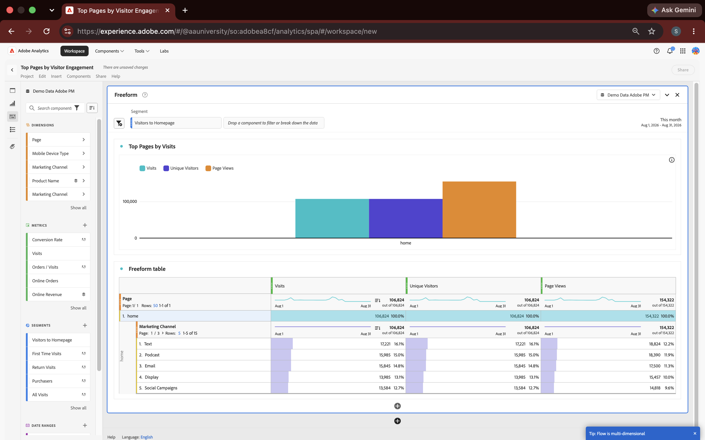

# Adobe Analytics: Visitor Engagement Analysis

A hands-on Adobe Analytics Analysis Workspace project using Adobe-provided demo data to explore website traffic, visitor engagement, and marketing channel performance.

## Overview

This project documents my hands-on experience using **Adobe Analytics Analysis Workspace** in Adobe's university sandbox environment.

Using the **Demo Data Adobe PM** report suite, I created a Workspace analysis to practice working with Adobe Analytics dimensions, metrics, segments, visualizations, and dimensional breakdowns.

The dataset used in this project was provided by Adobe for educational purposes. It does not contain proprietary company or customer data.

## What I Analyzed

I built a Freeform analysis focused on page-level visitor engagement and examined:

* Visits
* Unique Visitors
* Page Views
* Page-level website activity
* Marketing Channel performance
* Visitor segmentation

I also created and applied a **Visitors to Homepage** segment to focus the analysis on homepage visitor behavior.

## Adobe Analytics Skills Applied

### Analysis Workspace

Created and organized an Adobe Analytics Analysis Workspace project for interactive digital behavior analysis.

### Dimensions and Metrics

Used the **Page** dimension with key engagement metrics including:

* Visits
* Unique Visitors
* Page Views

### Segmentation

Created and applied a **Visitors to Homepage** segment to analyze a defined subset of website activity.

### Dimensional Breakdown

Broke homepage activity down by **Marketing Channel** to compare traffic from channels including:

* Text
* Podcast
* Email
* Display
* Social Campaigns

### Visualization

Created a visual comparison of visitor engagement metrics to make differences in website activity easier to interpret.

## Tools and Platform

* Adobe Analytics
* Adobe Analysis Workspace
* Freeform Tables
* Segments
* Dimensions
* Metrics
* Marketing Channel Breakdowns
* Data Visualization

## Project Evidence

### Analysis Workspace Screenshot

The screenshot above shows the completed Adobe Analytics Workspace analysis, including the applied segment, visualization, Freeform table, engagement metrics, and Marketing Channel breakdown.

### Raw Adobe Analytics Export

[View the Adobe Analytics CSV Export](adobe-analytics-raw-export.csv)

The CSV is the original raw export generated from Adobe Analytics Analysis Workspace. It is included as supporting documentation of the analysis.

Because it is a raw Adobe export, the file contains report metadata and table data in CSV format and may look different depending on the program used to open it.

## Key Takeaways

This project gave me practical experience navigating Adobe Analytics and using Analysis Workspace to turn digital behavior data into structured analysis.

Through the project, I gained hands-on familiarity with:

* Selecting relevant dimensions and metrics
* Building Freeform analyses
* Creating and applying segments
* Breaking dimensions down by Marketing Channel
* Comparing visitor engagement metrics
* Visualizing digital customer behavior
* Exporting Analysis Workspace results for documentation

## Adobe Experience Cloud Learning

In addition to this hands-on Adobe Analytics project, I completed Adobe Experience League training in **Fundamentals and Key Capabilities of Adobe Experience Platform**.

This training strengthened my understanding of Adobe Experience Platform concepts, including customer data, profiles, audiences, and activation within the broader Adobe Experience Cloud ecosystem.

## Transparency

This project was completed using **Adobe-provided educational demo data** in the Adobe Analytics University environment.

It is intended to demonstrate hands-on Adobe Analytics product familiarity and analytical skills. It does not represent production Adobe implementation experience or work performed with proprietary customer data.
